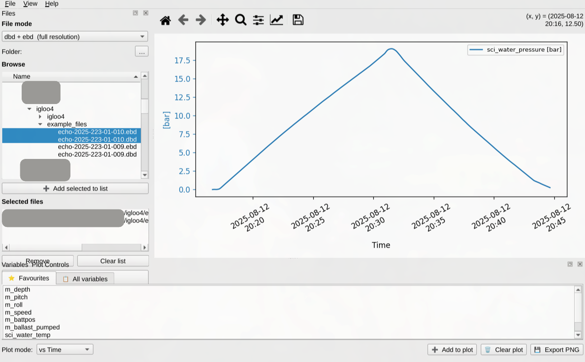

# Igloo4 — Slocum Glider Data Viewer

A desktop GUI application for exploring and plotting data from Slocum underwater glider binary files (`.dbd`, `.ebd`, `.sbd`, `.tbd`).



---

## Features

- **Two file modes** — full-resolution (`dbd + ebd`) or subset (`sbd + tbd`) files
- **Folder tree browser** — navigates your filesystem, automatically filtered to the relevant file extensions
- **Multi-file loading** — select and load one or more file pairs at once; data is merged transparently
- **Per-mode favourites** — a curated list of the most useful variables for each file mode, ready to plot immediately
- **Full variable catalogue** — searchable list of every variable present in the loaded files
- **Three plot modes**
  - *vs Time* — time on the X-axis; multiple variables on dual/shared Y-axes (grouped by physical unit)
  - *vs Depth* — depth inverted on the Y-axis; variables on independent X-axes
  - *vs Each Other* — scatter plot of any two variables
- **Interactive plots** — zoom, pan, and inspect via the built-in matplotlib toolbar
- **Export to PNG** — save the current plot at 150 dpi

---

## Requirements

| Dependency | Version |
|------------|---------|
| Python | ≥ 3.14 |
| [dbdreader](https://github.com/smerckel/dbdreader) | ≥ 0.5.8 |
| PyQt6 | ≥ 6.10.2 |
| matplotlib | ≥ 3.10.8 |
| scipy | ≥ 1.17.1 |

---

## Getting Started

### 1. Clone the repository

```bash
git clone <repo-url>
cd igloo4
```

### 2. Install dependencies with uv

[uv](https://docs.astral.sh/uv/) manages the virtual environment and dependencies automatically.

```bash
uv sync
```

### 3. Launch the app

```bash
uv run python main.py
```

---

## Usage

### Loading data

1. **Select a file mode** from the drop-down at the top of the left panel:
   - `dbd + ebd  (full resolution)` — typically thousands of variables
   - `sbd + tbd  (subset)` — ~35 variables, faster to load
2. Click **`…`** to pick a root folder; the tree will show only files matching the selected mode.
3. Select individual files (or a whole folder) in the tree, then click **`➕ Add selected to list`**.
4. Click **`⬆ Load files`** to read the data.

### Plotting variables

- Switch between **⭐ Favourites** and **📋 All variables** tabs in the bottom panel.
- Use the search box to filter the full variable list.
- **Double-click** a variable, or select it and click **`➕ Add to plot`**.
- Change the **Plot mode** combo box before adding variables:
  - `vs Time` — first variable gets the left Y-axis; each new unit gets a new right Y-axis.
  - `vs Depth` — depth is read automatically; variables appear on stacked X-axes.
  - `vs Each Other` — add exactly two variables for a scatter plot.
- Use the matplotlib toolbar (above the plot) to zoom, pan, and reset the view.
- Click **`🗑 Clear plot`** to start fresh.
- Click **`💾 Export PNG`** (or *File → Export plot as PNG…*) to save the figure.

---

## Project Structure

```
igloo4/
├── main.py               # Entry point
├── pyproject.toml        # uv project & dependencies
├── igloo4/
│   ├── config.py         # Favourites lists, mode→extension mapping, constants
│   ├── data_manager.py   # dbdreader wrapper with caching
│   ├── file_browser.py   # Left dock: mode selector + folder tree
│   ├── variable_panel.py # Bottom dock: variable lists + plot controls
│   ├── plot_widget.py    # Centre: matplotlib canvas + toolbar
│   └── main_window.py    # Top-level window, signal wiring
└── example_files/        # Sample dbd/ebd/sbd/tbd files for testing
```

---

## Default Favourites

| Mode | Variables |
|------|-----------|
| `dbd + ebd` | `m_depth`, `m_pitch`, `m_roll`, `m_speed`, `m_battpos`, `m_ballast_pumped`, `sci_water_temp`, `sci_water_cond`, `sci_water_pressure` |
| `sbd + tbd` | `m_depth`, `m_speed`, `m_battpos`, `sci_water_temp`, `sci_water_cond`, `sci_water_pressure`, `sci_oxy4_oxygen`, `sci_flntu_chlor_units` |

To customise the favourites, edit the `FAVOURITES` dict in `igloo4/config.py`.
